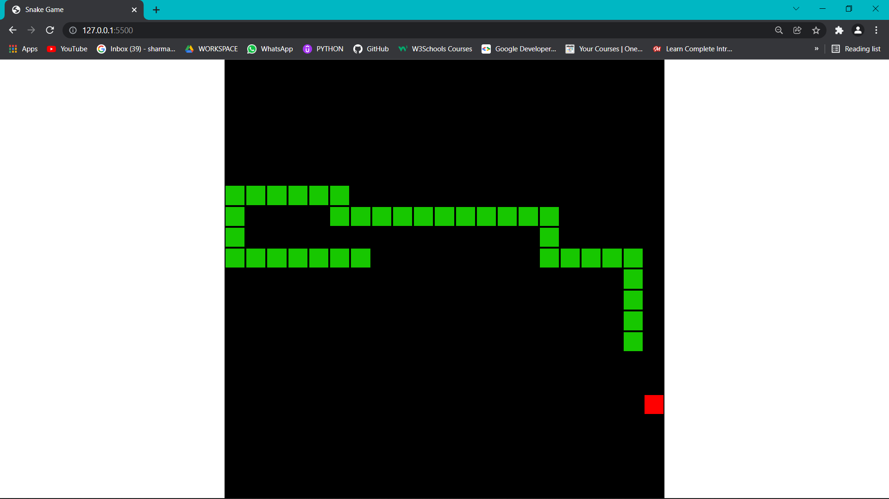

Snake Game

How to Run the Game:

Download project files from this repository.
Open the index.html file in a web browser.

Game Rules:

Control the snake using the arrow keys on the keyboard.
Collect food to increase the length of the snake.
Avoid collisions with the edges of the board and the snake's own tail.

Game Instructions:

After launching the game, press the "Start" button.
Use the arrow keys on the keyboard to control the snake.
The game ends when the snake hits the edge of the board or its own body.

Technologies:

JavaScript 
HTML   
CSS  

